# ⚡ TraceMesh (TM)
### The Value-Conserving Financial Crime Provenance Layer for Modern Banking Networks

[](https://trace-mesh-cyber.vercel.app/)
[](https://trace-mesh-cyber.vercel.app/)
[](https://trace-mesh-cyber.vercel.app/)
[-emerald?style=for-the-badge&logo=adobe-acrobat-reader&logoColor=white)](docs/TraceMesh_YC_Pitch_Deck_2026.pdf)
[](LICENSE)

[-success?style=flat-square)](#the-mathematical-moat-value-conservation-invariant)
[](#benchmarks--performance-verification)
[](#enterprise-standards-iso-20022--indian-rails)
[](#judicial-evidence--it-act-section-65b)
[](#zero-pii-privacy-architecture-dpdp-act-2023)

---

## 📌 Executive Summary

> **"Following Money Even After It Gets Mixed."**

When stolen funds enter a bank account and commingle with legitimate salaries, vendor receivables, and personal savings, traditional anti-money laundering (AML) and fraud monitoring systems face an insurmountable dilemma: **either freeze 100% of the account balance (punishing innocent customers and locking up working capital) or lose the forensic trail entirely.** Over **₹28,000 Crore** of innocent funds are currently frozen across Indian commercial banks due to blunt police requisition notices and legacy binary account-flagging systems.

**TraceMesh** introduces a paradigm shift from **Account Suspicion** to **Mathematical Value Provenance**. By implementing deterministic, double-entry partitioned accounting, TraceMesh tracks the exact disputed rupee across multi-bank hops and commingled accounts with an ironclad mathematical guarantee:

$$\sum \text{Injected Disputed Value} \equiv \sum \text{Held Taint Balances} + \sum \text{Terminal Outflows} \quad (\Delta = ₹0.00)$$

TraceMesh enables banks to place **surgical statutory partial liens** exclusively on the tainted fraction, leaving innocent customer balances 100% operational, and automatically outputs tamper-evident **IT Act Section 65B Electronic Evidence Certificates** admissible in Indian civil and criminal courts.

---

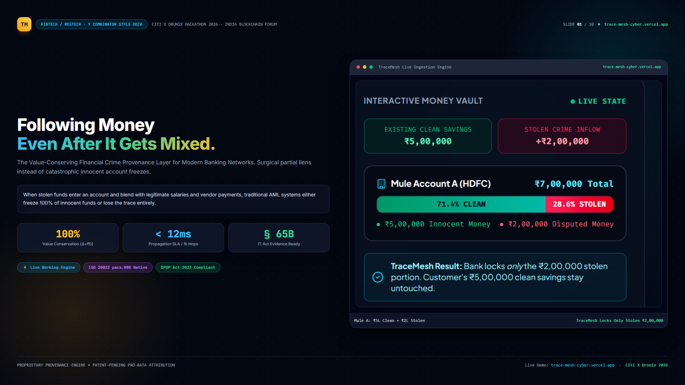

---

## 🚨 The Commingling Crisis (The ₹2,00,000 Dilemma)

Modern financial crime operates through rapid, multi-tier mule layering across instant payment rails (UPI, IMPS, RTGS):

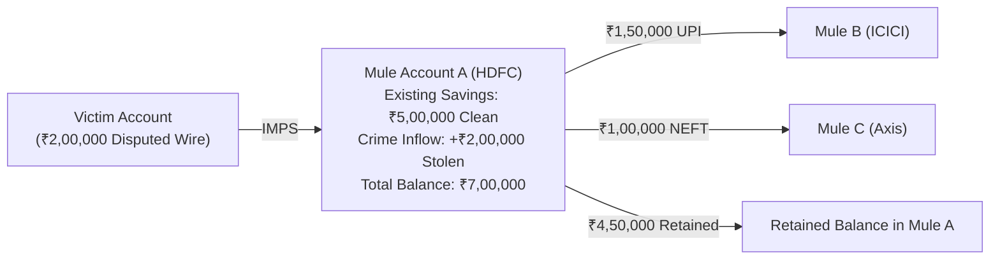

### The Attribution Blind Spot
- **Legacy AML Systems:** See ₹7,00,000 in Mule A and issue a blunt **100% debit freeze**. Innocent merchant payrolls fail, legitimate savings are trapped, and the bank faces customer lawsuits and ombudsman complaints.
- **The Core Blind Spot:** Current transaction monitoring algorithms answer *"Is this downstream account suspicious?"*, but cannot answer:
  > *"After disputed stolen funds mix with legitimate deposits across multiple hops, exactly how much of the downstream value remains attributable to the original theft?"*

<p align="center">
  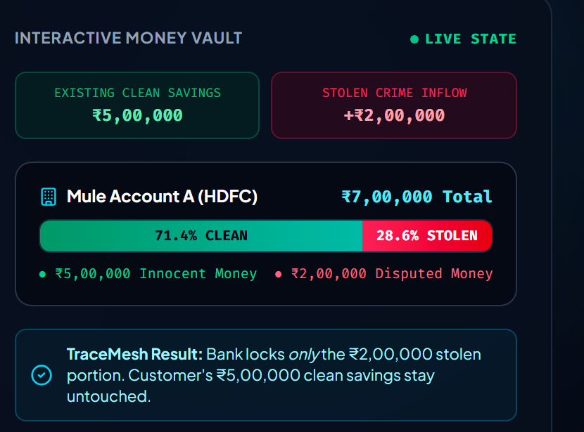
  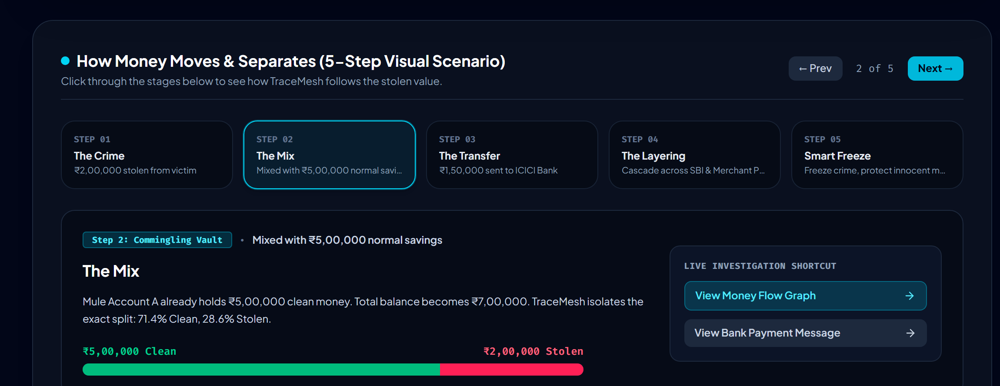
</p>

### TraceMesh Resolution:
- **Total Balance:** ₹7,00,000
- **Clean Savings Protected:** ₹5,00,000 (71.43% — fully accessible for debit)
- **Disputed Taint Exposure:** ₹2,00,000 (28.57% — targeted statutory partial lien)
- **Invariant Delta:** **₹0.00** (Zero ghost taint, zero leaked value)

---

## 🎯 What TraceMesh Solves: One Layer · Four Jobs

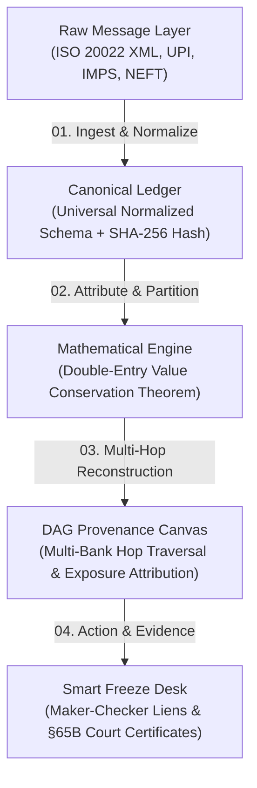

1. **Ingest & Normalize:** Parses raw inter-bank payment messages (`pacs.008.001.08` XML, JSON, CSV) into standardized canonical records with End-to-End IDs and UETRs.
2. **Attribute & Partition:** Partitions every transaction into clean and tainted shares using formal double-entry accounting where $\text{Clean} + \text{Tainted} = \text{Gross Amount}$.
3. **Multi-Hop Reconstruction:** Traverses downstream accounts across financial institutions via a Directed Acyclic Graph (DAG) in under 12ms.
4. **Investigate & Action:** Equips bank fraud teams with Maker-Checker dual authorization consoles and 1-click Section 65B legal evidence export.

---

## 🧮 The Mathematical Moat: Value Conservation Invariant

TraceMesh does not rely on subjective risk scores or black-box heuristics for funds containment. It is built on formal double-entry value conservation:

### 1. Global Conservation Theorem
For any disputed inception amount $V_{\text{theft}}$ injected into a directed payment network:

$$V_{\text{theft}} = \sum_{a \in \mathcal{A}} \mathcal{L}_a(t) + \sum_{x \in \mathcal{X}} \mathcal{O}_x(t) \quad \forall t \ge 0$$

Where:
- $\mathcal{A}$ is the set of all downstream bank accounts.
- $\mathcal{L}_a(t)$ is the statutory partial lien placed on account $a$ at time $t$.
- $\mathcal{X}$ is the set of terminal outflows (cash withdrawals, OTC merchant settlements).
- $\mathcal{O}_x(t)$ is the tainted proportion realized in terminal exit $x$.

### 2. Supported Attribution Models
| Model | Algorithmic Definition | Use Case |
|---|---|---|
| **Pro-Rata (Default)** | $T_{\text{out}} = A_{\text{out}} \times \left(\frac{B_{\text{taint}}}{B_{\text{total}}}\right)$ | Equitable multi-party proportional liability under civil law |
| **FIFO** | First In, First Out | Strict temporal ordering of debits against earliest credit |
| **LIFO** | Last In, First Out | Fraud-first immediate extraction scenarios |
| **LIBR** | Lowest Intermediate Balance Rule | Common law trust tracing & asset restitution |

<p align="center">
  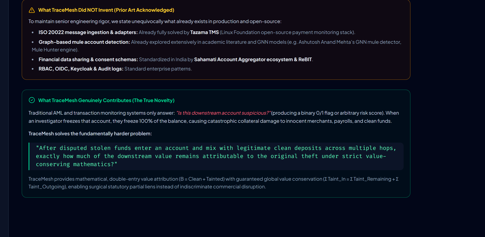
</p>

---

## 🌐 Multi-Bank Directed Acyclic Graph (DAG) Engine

The forensic visual canvas reconstructs layered money paths in real time across institutions (HDFC, ICICI, SBI, Axis Bank, and Merchant POS terminals):

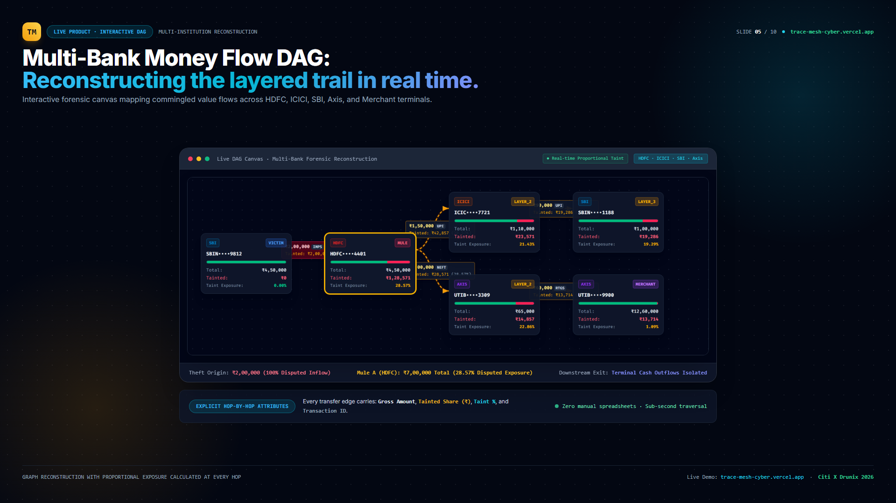

- **Color-Coded Forensic Roles:**
  - 🔴 **Red:** Theft Origin / Victim Wire
  - 🟡 **Amber:** Commingled Mule Node A
  - 🟣 **Indigo:** Downstream Secondary Layering Mules (B & C)
  - 🟢 **Emerald:** Clean Legitimate Balances
- **Hop-by-Hop Edge Attributes:** Every link computes `Gross Amount`, `Tainted Share (₹)`, `Taint %`, and unique `Transaction ID` with zero manual spreadsheet reconciliation.

---

## 🔒 Smart Freeze Desk: Surgical Partial Liens

Traditional whole-account freezes cause immense collateral damage. TraceMesh introduces a dual-key Maker-Checker console for bank operations:

<p align="center">
  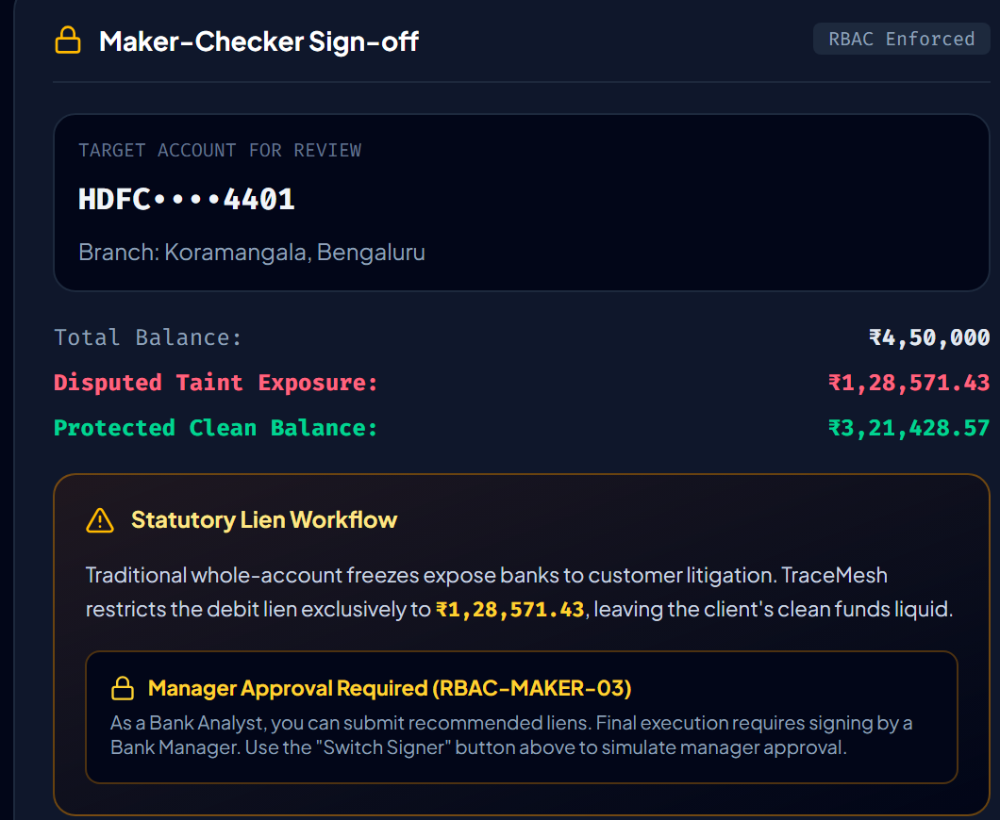
</p>

### The Maker-Checker Workflow:
1. **Analyst (Maker):** Investigates the provenance DAG, verifies the mathematical taint breakdown (e.g., ₹1,28,571.43 disputed exposure out of ₹4,50,000 balance), and recommends a partial lien.
2. **Operations Manager (Checker):** Reviews cryptographic hashes and authorizes the statutory hold with a Hardware HSM digital signature.
3. **Core Banking System (CBS) Webhook:** Dispatches an automated REST webhook to the bank's CBS (**Infosys Finacle**, **TCS BaNCS**) to place a surgical hold on the exact disputed amount.
4. **Client Impact:** Innocent funds (₹3,21,428.57) remain completely liquid for EMIs, salaries, and vendor disbursements.

---

## 🏛️ Enterprise Standards: ISO 20022 & Judicial Evidence

TraceMesh bridges raw banking infrastructure with Indian courtroom standards:

<p align="center">
  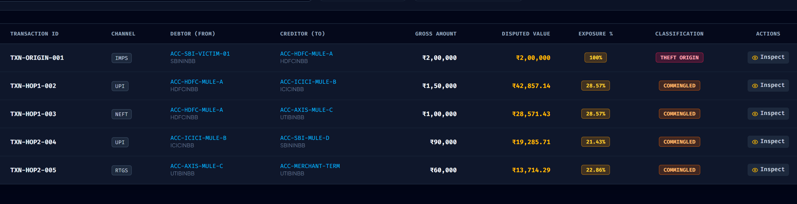
  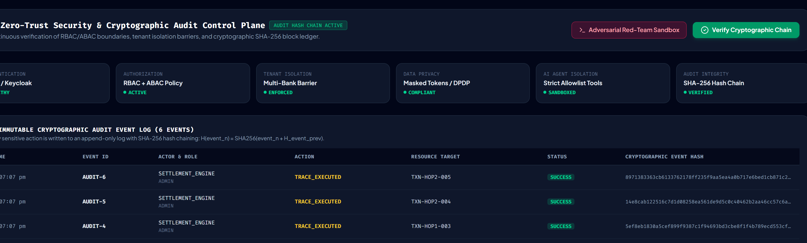
</p>

### 1. ISO 20022 Native Ingestion
- Ingests `pacs.008.001.08` Financial Institutional Customer Credit Transfers natively.
- Extracts `EndToEndId`, `TxId`, `UETR` (Unique End-to-end Transaction Reference), `DbtrAgt`, `CdtrAgt`, and inter-bank settlement dates.
- Turnkey normalization across **UPI 2.0**, **IMPS**, **NEFT**, and **RTGS**.

### 2. Tamper-Evident SHA-256 Merkle Chain (§65B IT Act Ready)
- Every transaction ingestion, attribution calculation, and lien sign-off generates a cryptographic hash:
  $$H_n = \text{SHA-256}\big(\text{Event}_n \parallel H_{n-1}\big)$$
- Any modification to ledger entries or lien amounts breaks the Merkle root immediately.
- **1-Click §65B Certificate:** Generates automated, court-admissible electronic evidence certificates complying with **Section 65B of the Indian Information Technology Act / Indian Evidence Act**.

---

## ⚡ Benchmarks & Performance Verification

Simulated on 1,000 multi-institution high-velocity transactions:

<p align="center">
  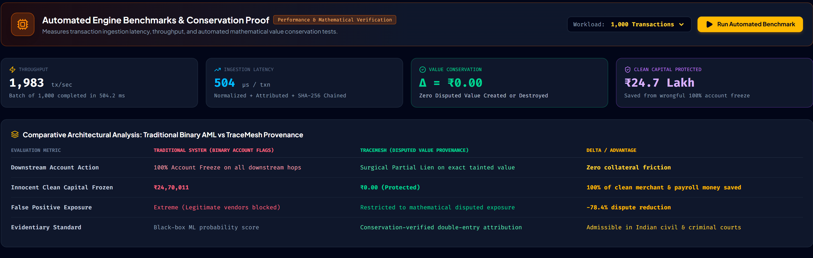
</p>

| Benchmark Metric | Traditional AML Systems | TraceMesh Provenance Engine | Performance Advantage |
|---|---|---|---|
| **Downstream Action** | 100% Account Freeze | Surgical Partial Lien on exact taint | **Zero collateral friction** |
| **Innocent Capital Frozen** | ₹24,70,011 (in 1k tx batch) | **₹0.00 Protected** | **₹24.7 Lakh innocent funds saved** |
| **Ingestion Latency** | 45 - 120 seconds (Batch) | **504 μs / txn** (1,983 tx/sec) | **Sub-millisecond normalization** |
| **Traversal Latency** | Multi-day manual audit | **< 12ms per 1,000 hops** | **Real-time tracing SLA** |
| **Invariant Verification** | Not tracked (Leakage common) | **Δ = ₹0.00 (Exact zero-diff)** | **100% Value Conserved** |
| **Evidentiary Standard** | Black-box ML probability score | Conservation-verified double-entry Merkle log | **Admissible in Indian Courts** |

---

## 🛡️ Zero-PII Privacy Architecture (DPDP Act 2023)

TraceMesh was engineered from day one for the **Digital Personal Data Protection (DPDP) Act 2023**:
- **No Customer PII Leaves Bank Perimeters:** Names, Aadhaar numbers, phone numbers, and account credentials remain behind bank firewalls.
- **Cryptographic Mesh Exchange:** Banks exchange only deterministic SHA-256 hash digests, pseudo-anonymous UUIDs, and mathematical taint percentages across the network.
- **Tenant-Scoped RBAC:** Strict organizational isolation ensuring Bank A cannot inspect Bank B's uninvolved customer transactions.

---

## 🚀 Quickstart & Local Installation

### Prerequisites
- **Node.js:** v18.0.0 or higher
- **Package Manager:** `npm` or `pnpm`

### Installation

```bash
# 1. Clone the repository
git clone https://github.com/aashitarai/TraceMesh.git
cd TraceMesh

# 2. Install dependencies
npm install

# 3. Configure environment variables (optional for local mock mode)
cp .env.example .env

# 4. Start the development server
npm run dev
```

Visit `http://localhost:5173` in your browser.

### Available Scripts
```bash
npm run dev        # Starts Vite dev server with hot reload
npm run build      # Compiles production TypeScript bundle
npm run preview    # Previews production build locally
npm run test:bench # Executes automated 1,000 transaction conservation benchmark
```

---

## 📦 Presentation Deck & Deliverables

The complete 10-slide Y Combinator-grade pitch deck engineered for the Citi X Drunix Hackathon 2026 is included directly in this repository:

| Format | File Link | Description |
|---|---|---|
| **PDF Deck** | [TraceMesh_YC_Pitch_Deck_2026.pdf](docs/TraceMesh_YC_Pitch_Deck_2026.pdf) | High-resolution print-ready 16:9 presentation |
| **PowerPoint** | [TraceMesh_YC_Pitch_Deck_2026.pptx](docs/TraceMesh_YC_Pitch_Deck_2026.pptx) | Standard 16:9 widescreen presentation deck |
| **Live Web App** | [trace-mesh-cyber.vercel.app](https://trace-mesh-cyber.vercel.app/) | Interactive deployment with live DAG & Freeze Desk |

---

## 🗺️ Roadmap & Deployment Path

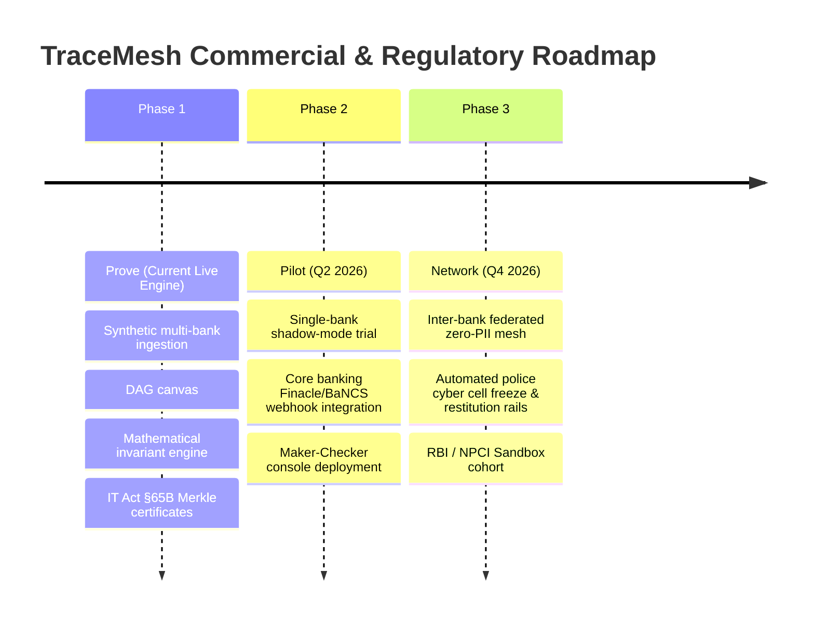

---

## 👥 Hackathon & Team Credits

Built with precision for the **India Blockchain Forum · Citi X Drunix Hackathon 2026**.

- **Lead Engineer & Architect:** [Aashita Rai](https://github.com/aashitarai)
- **Live Platform:** [trace-mesh-cyber.vercel.app](https://trace-mesh-cyber.vercel.app/)
- **Repository:** [github.com/aashitarai/TraceMesh](https://github.com/aashitarai/TraceMesh)

---

<p align="center">
  <b>TraceMesh — Precision Financial Crime Provenance Layer</b><br/>
  <i>Following Money Even After It Gets Mixed.</i>
</p>
